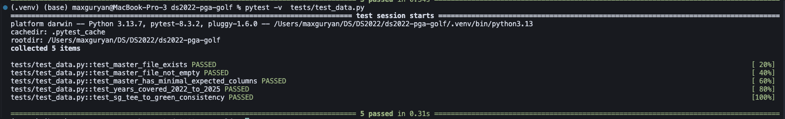
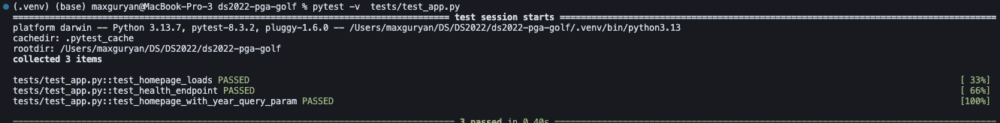
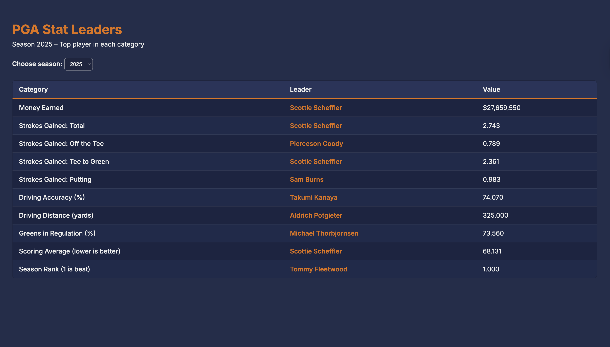
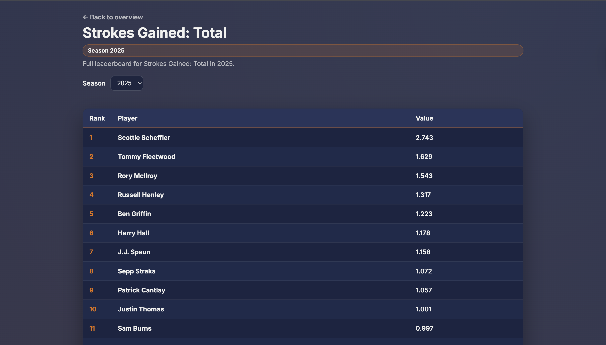

# PGA TOUR Stats Pipeline & Flask Dashboard

## 1. Executive Summary
### Problem
The PGA Tour collects statistical data (strokes gained, driving distance, scoring, ranking, etc.), which is displayed on the PGA Tour website. Many analysts and fans want to compare player performance throughout a season, across different seasons, or view category leaders, which is displayed on their website. However, the data, which is publicly available, is spread across multiple separate CSV endpoints, making it hard to obtain a complete dataset of all stats collected on the PGA Tour for a given season or range of seasons.
### Solution
This project builds a fully containerized data pipeline and Flask dashboard. Through this pipeline, raw CSV files are downloaded, the data is cleaned and normalized, and then merged into two different master datasets. One is a dataset with all statistical categories during a given season, and the other is a dataset with all statistical categories over a range of seasons. This data is displayed through a dashboard, allowing a fan or analyst to toggle between seasons and see which player leads in each category during that specific season. Despite the dashboards simplicity, it is for proof of concept, showing that we now have all the data in one place. This entire containerized system can be run with a single pipeline command `./run.sh`.

## 2. System Overview

### Concept(s)/Tool(s) Used:
- Data pipelines
- Flask API
- Docker Containerization
- Smoke Testing and Health Checks

### Architecture Diagrams

#### Pipeline

This pipeline shows the steps taken through the Dockerfile when you run the `./run.sh` command. 

#### Flowchart

This flowchart represents how each datapoint is represented on the dashboard based on the users input.

#### Project Folder Tree
```
ds2022-pga-golf/
│
├── Dockerfile                   # Defines build-run environment; runs the pipeline
├── run.sh                       # One-command build + run (no cache)
├── requirements.txt             # Python dependencies
├── README.md                    # Full project write-up
├── LICENSE                      # MIT license
├── .gitignore                   # Excludes local env + data dirs
├── .env.example                 # Example environment variables (no secrets)
│
├── assets/                      # Static documentation assets
│   ├── pipeline.png             # Pipeline diagram
│   ├── flowchart.png            # App flowchart
│   ├── dashboard.png            # Screenshot of dashboard
│   ├── second_dashboard.png     # NEW: Secondary dashboard screenshot
│   ├── app_test.png             # NEW: Screenshot for app smoke test
│   ├── data_test.png            # NEW: Screenshot for data pipeline test
│
├── src/                         # All application + pipeline code
│   ├── app.py                   # Flask server
│   ├── download_stats.py        # Download raw PGA stats
│   ├── parse_stats.py           # Normalize + clean data
│   ├── build_master.py          # Merge into master dataset
│
├── templates/
│   ├── index.html               # Dashboard page template (Jinja2)
│   └── category.html            # Category-specific page template
│
├── tests/                       # Smoke tests (pytest)
│   ├── test_data.py             # Dataset validation tests
│   └── test_app.py              # Flask app tests
│
└── data/                        # Created only inside Docker container
    ├── raw/                     # Raw CSVs from PGA API
    ├── intermediate/            # Cleaned intermediate CSVs
    └── processed/               # Final master_player_seasons.csv

```

#### Data Sources
All PGA Data came from the PGA's official CSV API:
```
https://www.pgatour.com/api/stats-download?timePeriod=THROUGH_EVENT&tourCode=R&statsId=<ID>&year=<YEAR>
```

#### Stats Included
- Strokes Gained (Total, OTT, Approach, ARG, Putting)
- Driving Distance
- Driving Accuracy
- Greens in Regulation
- Scoring Average
- Money Earned
- FedEx-style Season Rank
- Derived: Strokes Gained Tee-to-Green (Strokes Gained Total excluding Putting)
#### Data Credits
This project uses publicly available PGA TOUR data exclusively for educational and non-commercial use.
All PGA data is © PGA TOUR

## 3. How to Run with Docker (Local)
In your terminal paste:
```bash
./run.sh
```
This runs `run.sh` which contains:

```bash
#!/usr/bin/env bash
set -euo pipefail

PORT="${PORT:-8000}"

echo "Ensuring port ${PORT} is free..."
if lsof -tiTCP:"${PORT}" -sTCP:LISTEN >/dev/null 2>&1; then
  echo "Port ${PORT} in use. Attempting to terminate listener(s)..."
  pids=$(lsof -tiTCP:"${PORT}" -sTCP:LISTEN)
  kill ${pids}
  sleep 1
fi

if lsof -tiTCP:"${PORT}" -sTCP:LISTEN >/dev/null 2>&1; then
  echo "Port ${PORT} is still in use. Please free it manually and rerun." >&2
  exit 1
fi

echo "Building image..."
docker build -t pga-stats:latest .

echo "Starting container on port ${PORT}..."
docker run --rm -p "${PORT}:8000" pga-stats:latest

echo "Health check..."
curl "http://localhost:${PORT}/health"
```
## 4. Design Decisions
### Why this concept?
There were certain limitations to how I would be able to download the CSV files because I needed to compile multiple CSVs, make sure they were all formatted the right way, and merge them together without losing data. With these parameters in mind, there were only a few options that I had. First, instead of using the PGA TOUR CSV API I could've scraped the PGA TOUR webpages to collect stats, but this method is weak and violates the PGA TOUR's rules and regulations. Scraping webpages is brittle because one small change in the HTML script of the website can break the code, forcing you to parse through the HTML script, find the change(s), and adjust the code accordingly. Using the PGA TOUR CSV API is preferred because it returns a readable CSV file, API endpoints change significantly less frequently than webpage HTMLs, making it less likely that the code will break. Looking bigger picture, this method is a better fit for reproducible Docker builds, which is a key component of this project. Another concept that could've been used was SQLite. A SQLite database could've been created housing tables like `raw_stats`, `intermediate_stats`, and `master_stats`. The downloaded CSVs would be inserted into the database, and SQL queries could've been used to complete all of the functions that Pandas completed. This could've been a viable option, but it comes with unnecessary overhead for a project of this size. The master CSV file is only about $1000$ rows, which is relatively small. If the CSV file were larger in size, SQLite would've been a better choice, but in this instance, there was only added complexity and no added efficiency. Next, a Flask App was used to create the dashboard because that was the only method we learned. I am sure that there are other ways to end up with the same dashboard, or something better, but I decided to stick with what I was familiar with, as this is my first project of this size. Finally, Docker was chosen over Apptainer as the method of containerization because this project runs locally instead of on an HPC cluster. Docker is pretty standard for use cases like this one. However, if this project were to be done on UVA's HPC cluster, then Apptainer would be a better choice because it is a very effective containerization method for rootless multi-user systems like HPC clusters. 

### Tradeoffs
#### Build-time vs runtime pipeline
I chose to run `download_stats.py`, `parse_stats.py`, and `build_master.py` inside the Docker build. This was done because it allows anyone to run the `run.sh` pipeline in its entirety on any device or OS. The size of the git repo is smaller because no CSV files are housed inside it, which leads to slow clones. Additionally, running these scripts inside the Docker build allows for one singular command to initiate and complete the entire project. One of the major tradeoffs of this is that the time to build the Docker image and the size of the Docker image are increased. However, for this project, the size of the dataset is relatively small, so this increase is relatively inconsequential.
#### Simplicity
As I mentioned above, I chose to use a Flask App for the frontend dashboard. Flask Apps are great because they have a very low level of complexity, which makes it easier for me to create. This also keeps the focus on the data-pipeline aspect of this project, which is the main goal of this project. There are downsides to this choice. On the users end, the dashboard is less interactive and oversimplified. I made this choice because Flask Apps were the only thing that we had worked with so far. This was my first project of this magnitude and I tried to keep things as simple as possible.  

### Security and Privacy
#### Data Sensitivity and privacy
There is no handling of private or sensitive user data in this project. The dataset consists completely of public performance statistics of professional golfers.
- All data comes from a public source: PGA TOUR stats
- There are no user accounts
- There is no need for PII since all information in public
  
#### Secrets and environment variables
I have included `.env.example` and `.gitignore` which will keep secrets out of the repo. However, the current project does not require things like API keys, so there are no secrets. 


## 5. Results and Evaluation
### Testing and Validation
There are two external testing python scripts, `test_data.py` and `test_app.py`. Each of which helps catch early issues and acts as a health check for the entire pipeline. These tests can be found in the `tests` folder. 

#### Data Tests
- Verifies the existence and non-emptiness of the data set
- Confirms the presence of expected columns
- Ensures all expected years are included
- Confirms correctness of the derived metric `sg_tee_to_green`
Run this in your terminal:
```bash
./tests/test_data.py
```
If the test was successful, this is the message you should receive in your terminal:

If there are errors, you will receive a message pinpointing what and where the error is.

#### App Test
- Confirms that the homepage loads with HTTP 200
- Verifies that season-specific routes return valid responses
- Ensures no unexpected server errors occurred
Run this in your terminal

```bash
./tests/test_app.py
```

If the test was successful, this is the message you should receive in your terminal:

If there are errors, you will receive a message pinpointing what and where the error is.

### Primary Dashboard  

After running the `run.sh` pipeline and clicking on the local host port, this is what the dashboard should look like.

### Secondary Dashboard

If you want to inspect the entire list of players, ranked from best to worst, on a given stat in a given year, click on the icon and this is an example of what will show up.

### Health Check
After running the `run.sh` pipeline, open a new terminal, cd into `ds2022-pga-golf` and run the following code:
```bash
curl http://localhost:8000/health
```
You should get a response like the one below. This means that the Flask App dashboard is running.
```json
{"status":"ok"}
```
## 6. What's Next
This project is very simple, meaning that there are many ways that we can make this more complex. Starting on the dataset pipeline side, adding more years to the master_dataset would enhance this project. In order to keep this project's image relatively small, only use data from 2022-2025 was included. Expanding the dataset to include values from years prior to 2022 creates a more comprehensive dataset that could be used to analyze the relationship between a golfer's success and the part(s) of their game that are better than the rest. On the Flask App dashboard side of this project, giving users the ability to compare two players across all metrics would add complexity and practicality to this project. Continuing on with the idea that this dataset could be used to show the relationship between a golfer's success and the part(s) of their game that are better than the rest. The success of a golfer could be quantified through either money earned or points earned and compared to each specific strokes gained (SG) category. After EDA (exploratory data analysis), regression models, and potentially predictive models, this data could be used to determine the likelihood of a players success based on the their performance in each SG category. 

## 7. Links
**GitHub Repo:** [link](https://github.com/MaxGuryan9/ds2022-pga-golf)
