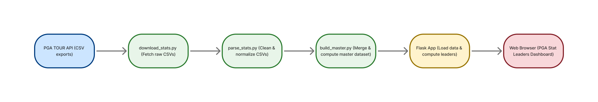
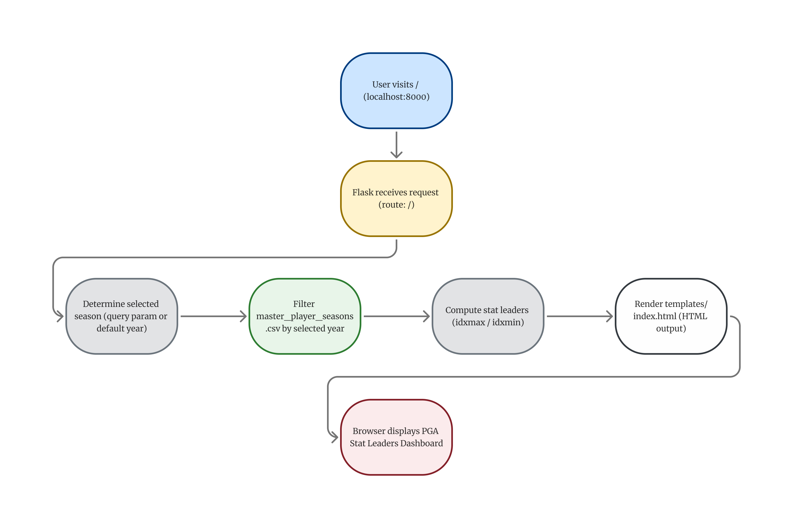

# PGA TOUR Stats Pipeline & Flask Dashboard

## 1. Executive Summary
### Problem
The PGA Tour collects statistical data (strokes gained, driving distance, scoring, ranking, etc.), which is displayed on the PGA Tour website. Many analysts and fans want to compare player performance throughout a season, across different seasons, or view category leaders, which is displayed on their website. However, the data, which is publicly available, is spread across multiple separate CSV endpoints, making it hard to obtain a complete dataset of all stats collected on the PGA Tour for a given season or range of seasons.
### Solution
This project builds a fully containerized data pipeline and Flask dashboard. Through this pipeline, raw CSV files are downloaded, the data is cleaned and normalized, and then merged into two different master datasets. One is a dataset with all statistical categories during a given season, and the other is a dataset with all statistical categories over a range of seasons. This data is displayed through a dashboard, allowing a fan or analyst to toggle between seasons and see which player leads in each category during that specific season. Despite the dashboards simplicity, it is for proof of concept, showing that we now have all the data in one place. This entire containerized system can be run with a single pipeline command `./run.sh`.

## 2. System Overview

### Concept(s)/Tool(s) Used:
- Data pipelines
- Flask API
- Docker Containerization
- Smoke Testing and Health Checks

### Architecture Diagrams

#### Pipeline

This pipeline shows the steps taken through the Dockerfile when you run the `./run.sh` command. 

#### Flowchart

This flowchart represents how each datapoint is represented on the dashboard based on the users input.

#### Project Folder Tree
```
ds2022-pga-golf/
│
├── Dockerfile                   # Defines build-run environment; runs the pipeline
├── run.sh                       # One-command build + run (no cache)
├── requirements.txt             # Python dependencies
├── README.md                    # Full project write-up
├── LICENSE                      # MIT license
├── .gitignore                   # Excludes local env + data dirs
├── .env.example                 # Example environment variables (no secrets)
│
├── assets/                      # Static documentation assets
│   ├── pipeline.png             # Pipeline diagram
│   ├── flowchart.png            # App flowchart
│   └── dashboard.png            # Screenshot of dashboard
│
├── src/                         # All application + pipeline code
│   ├── app.py                   # Flask server
│   ├── download_stats.py        # Download raw PGA stats
│   ├── parse_stats.py           # Normalize + clean data
│   ├── build_master.py          # Merge into master dataset
│
├── templates/
│   └── index.html               # Dashboard page template (Jinja2)
│
├── tests/                       # Smoke tests (pytest)
│   ├── test_data.py             # Dataset validation tests
│   └── test_app.py              # Flask app tests
│
└── data/                        # Created only inside Docker container
    ├── raw/                     # Raw CSVs from PGA API
    ├── intermediate/            # Cleaned intermediate CSVs
    └── processed/               # Final master_player_seasons.csv

```

#### Data Sources
All PGA Data came from the PGA's official CSV API:
```
https://www.pgatour.com/api/stats-download?timePeriod=THROUGH_EVENT&tourCode=R&statsId=<ID>&year=<YEAR>
```

#### Stats Included
- Strokes Gained (Total, OTT, Approach, ARG, Putting)
- Driving Distance
- Driving Accuracy
- Greens in Regulation
- Scoring Average
- Money Earned
- FedEx-style Season Rank
- Derived: Strokes Gained Tee-to-Green (Strokes Gained Total excluding Putting)
#### Data Credits
This project uses publicly available PGA TOUR data exclusively for educational and non-commercial use.
All PGA data is © PGA TOUR

## 3. How to Run with Docker (Local)
In your terminal paste:
```
./run.sh
```
This runs `run.sh` which contains:

```python
#!/usr/bin/env bash
docker build -t pga-stats:latest .

docker run --rm -p 8000:8000 pga-stats:latest

curl http://localhost:8000/health

```
## 4. Design Decisions
### Why this concept?
There were certain limitations to how I would be able to download the CSV files because I needed to compile multiple CSVs, make sure they were all formatted the right way, and merge them together without losing data. With these parameters in mind, there were only a few options that I had. First, instead of using the PGA TOUR CSV API I could've scraped the PGA TOUR webpages to collect stats, but this method is weak and violates the PGA TOUR's rules and regulations. Scraping webpages is brittle because one small change in the HTML script of the website can break the code, forcing you to parse through the HTML script, find the change(s), and adjust the code accordingly. Using the PGA TOUR CSV API is preferred because it returns a readable CSV file, API endpoints change significantly less frequently than webpage HTMLs, making it less likely that the code will break. Looking bigger picture, this method is a better fit for reproducible Docker builds, which is a key component of this project. Another concept that could've been used was SQLite. A SQLite database could've been created housing tables like `raw_stats`, `intermediate_stats`, and `master_stats`. The downloaded CSVs would be inserted into the database, and SQL queries could've been used to complete all of the functions that Pandas completed. This could've been a viable option, but it comes with unnecessary overhead for a project of this size. The master CSV file is only about $1000$ rows, which is relatively small. If the CSV file were larger in size, SQLite would've been a better choice, but in this instance, there was only added complexity and no added efficiency. Next, a Flask App was used to create the dashboard because that was the only method we learned. I am sure that there are other ways to end up with the same dashboard, or something better, but I decided to stick with what I was familiar with, as this is my first project of this size. Finally, Docker was chosen over Apptainer as the method of containerization because this project runs locally instead of on an HPC cluster. Docker is pretty standard for use cases like this one. However, if this project were to be done on UVA's HPC cluster, then Apptainer would be a better choice because it is a very effective containerization method for rootless multi-user systems like HPC clusters. 